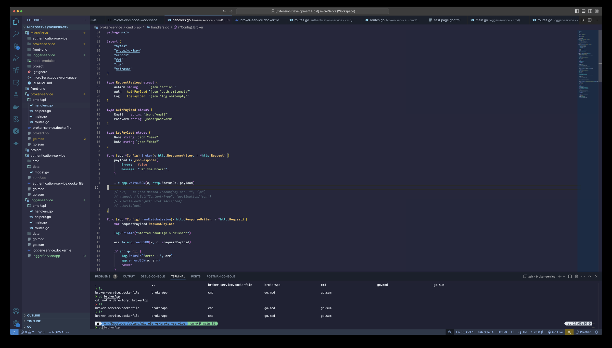
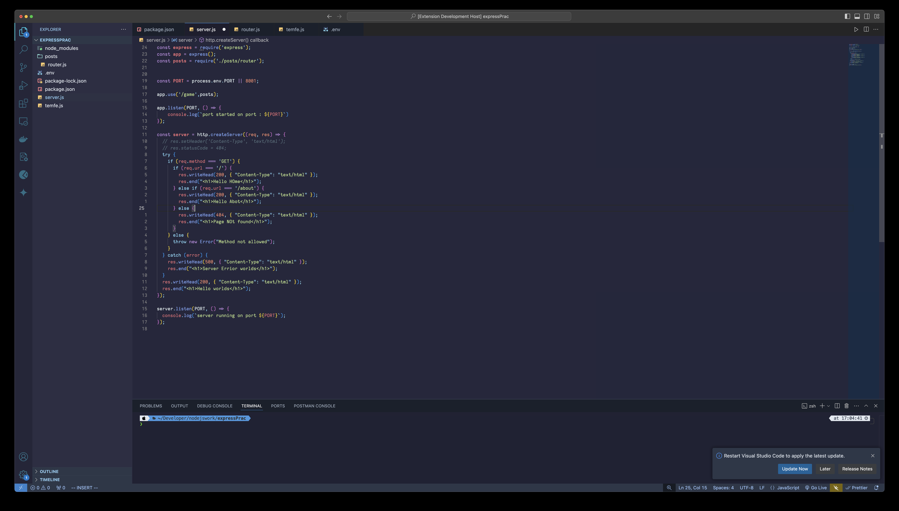

# Shades — a family of themes for people who read code all day

Ten themes built from one palette system. Eight dark, two light. They share a single
generator, so every one of them covers the same 650 interface colors and passes the same
readability audit — no variant is the one that forgot to style the merge conflicts.

## Theme Overview

### Go


### JS


## The family

| Theme | | For |
|---|---|---|
| **Shades** | dark | The original. Deep indigo, cyan accents, tuned for Go. |
| **Shades of Stoicism Nocturne** | dark | Deep indigo night. Vivid accents on a low-glare blue-violet base. |
| **Shades of Stoicism Aurora** | dark | Arctic calm. Low-chroma steel and sage for long, quiet sessions. |
| **Shades of Stoicism Ember** | dark | Warm retro terminal. Amber and olive on toasted charcoal, no blue glare. |
| **Shades of Stoicism Mocha** | dark | Soft pastels on warm plum. Gentle contrast that never shouts. |
| **Shades of Stoicism Abyss** | dark | Near-black OLED contrast. Sharp, saturated hues for bright rooms. |
| **Shades of Stoicism Verdant** | dark | Deep forest. Botanical greens with water blues and sunlit gold. |
| **Shades of Stoicism Muted** | dark | Low-color focus. Near-monochrome code; color reserved for strings and real problems. |
| **Shades of Stoicism Daylight** | light | Warm paper. Ink-grade contrast without the glare of pure white. |
| **Shades of Stoicism Frost** | light | Cool daylight. Crisp blue-grey surfaces with saturated, high-contrast code. |

Every variant is prefixed **Shades of Stoicism** so the family groups together in the
theme picker. The original keeps its short label, `Shades`, so that existing
`workbench.colorTheme` settings keep working.

Pick one with `Ctrl/Cmd + K, Ctrl/Cmd + T`. Pair a light and a dark one by turning on
`window.autoDetectColorScheme` and setting `workbench.preferredDarkColorTheme` and
`workbench.preferredLightColorTheme` — VS Code will then follow your OS.

## What makes them different

### One perceived brightness across every syntax color

HSL lightness lies: `#0000ff` and `#ffff00` are both "50%" and nowhere near equally bright.
These themes are generated in **OKLCH**, where lightness matches what the eye reports, and
every syntax color in a theme is pinned to the same `L` value. A line of code stops
flickering bright-dim-bright, and your eye is pulled by *meaning* instead of by whichever
token happens to be palest.

Diagnostics deliberately break that rule. An error should out-shout the code around it.

### Audited, not eyeballed

The build fails if any color that carries code drops below **4.5:1** against its
background, if comments fall below 3:1, or if two syntax hues are indistinguishable. It
warns when surfaces are far enough apart to read as banding, when comments are loud enough
to compete with code, and when red and green sit at the same lightness — the one pairing a
colorblind reader cannot resolve. Diff and merge colors carry borders as well as fills for
exactly that reason.

Measured body-text contrast runs 10.9:1 to 15.2:1 depending on the variant.

### Backgrounds that don't glare

No pure black, no pure white. Dark variants sit in the `#151e1a`–`#232936` band; the OLED
variant goes lower and raises chroma to compensate. Foregrounds are dimmed rather than
white, which reduces the halation that makes bright glyphs bleed on dark backgrounds —
particularly for the roughly one in three adults with astigmatism.

### The whole modern editor, not just the text

Most themes were written for the 2019 layout. These cover what VS Code actually looks like
now:

- **Chat and inline chat** — request bubbles, slash commands, the added/removed line pills,
  checkpoint separators, the thinking shimmer, and the inline chat input.
- **Command Center** — the title-bar pill, including its debugging state.
- **Bracket pair guides** — the separate `editorBracketPairGuide` family, which the
  recommended settings below actually switch on.
- **Inline edits and ghost text** — kept above 3:1 so AI suggestions are actually reviewable.
- **Multi-file diff** — where agent change-reviews render.
- **Terminal command decorations** — the pass/fail dots in the terminal gutter.
- Plus bracket pair colors 1–6, active indent guides 1–6, inlay hints, sticky scroll, peek
  view, merge conflicts, test coverage, comments/review, notebooks, and all 16 ANSI colors
  derived from the theme's own syntax hues so the terminal matches the editor.

### Syntax that means something

Colors map to roles, consistently, across all ten themes:

- **Bold marks declarations**, never calls — so "where is this defined" has a visual analogue.
- **Italic marks context** — comments, parameters, `this`/`self`, builtins, type parameters.
- **Variables are usually left uncolored.** When everything is vivid, nothing is. The
  colored things are the ones worth finding.
- Go, TypeScript, Python, Rust, CSS, JSON, YAML, Markdown and diff output all get specific
  attention, and semantic highlighting is enabled so language servers can refine it further.

## Installation

1. Open VS Code
2. Press `Ctrl/Cmd + P`
3. Type `ext install ddh4r4m.shadesai`
4. Press Enter, then pick a variant with `Ctrl/Cmd + K, Ctrl/Cmd + T`

## Recommended settings

```json
{
  "editor.fontLigatures": true,
  "editor.bracketPairColorization.enabled": true,
  "editor.guides.bracketPairs": "active",
  "editor.renderWhitespace": "selection",
  "editor.renderLineHighlight": "all",
  "editor.stickyScroll.enabled": true,
  "workbench.tree.renderIndentGuides": "always"
}
```

## Building and contributing

Themes are **generated, not hand-edited**. Editing `themes/*.json` directly is wasted work;
the next build overwrites it.

```
tools/palettes.js     one object per theme: roles -> hex. The creative surface.
tools/build-theme.js  palette -> full theme. Workbench keys and token scopes live here.
tools/color.js        OKLCH, contrast, gamut-safe lightness, perceptual mixing.
tools/build.js        builds all themes, audits them, syncs package.json.
```

```bash
npm run build:themes   # generate + audit + sync package.json
npm run check:themes   # audit only, no writes
```

To propose a new variant, add a palette to `tools/palettes.js` and run the build. If the
audit complains, it's usually right. To change something for *every* theme — a missing
workbench key, a token scope — edit `tools/build-theme.js` once.

The design rules behind all of this are written up in
`.claude/skills/color-theme-design/`, including a checklist of the VS Code color keys most
themes miss.

## Feedback and support

Screenshots help enormously for color issues — what looks wrong on your display and font
may look fine on mine.

- Issues and feature requests: [GitHub Issues](https://github.com/ddh4r4m/Shades/issues)
- Star the repository: [Shades Theme](https://github.com/ddh4r4m/Shades)
- Reviews: [VS Code Marketplace](https://marketplace.visualstudio.com/items?itemName=ddh4r4m.shades)
- Author: [ddh4r4m](https://github.com/ddh4r4m)

## License

MIT. Free for personal and commercial use.

---

If Shades works for you, consider starring the repo or leaving a review — both genuinely
help other developers find it.
