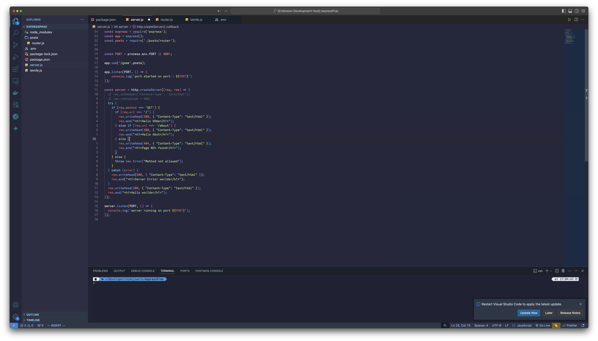

# Shades : Smart Syntax Theme 🎨

Transform your coding experience with a thoughtfully crafted theme that combines aesthetic beauty with functional design. This isn't just another color scheme – it's a complete visual enhancement designed to make your code more readable, your debugging more intuitive, and your development workflow more enjoyable.


## Theme Overview
### Go


### JS


## Why Choose This Theme? 🌟

Our theme has been meticulously designed with both aesthetics and functionality in mind. Every color choice serves a purpose, making your code not just beautiful, but more understandable and maintainable.

### Enhanced Syntax Highlighting for Go and Beyond

Experience unparalleled syntax highlighting that makes your code structure instantly apparent. Our theme provides special enhancements for Go programming, including:

- **Context-Aware Variables**: Different colors for primary variables and error variables, making error handling patterns immediately visible
- **Function Visibility**: Bold function declarations with distinctive colors that separate them from regular function calls
- **Type System Enhancement**: Clear visual distinction for types, interfaces, and structs
- **Package Management**: Intuitive coloring for package declarations and imports
- **Error Highlighting**: Special attention to error variables and nil values with bold and italic styles

### Innovative UI Elements

We've reimagined every aspect of the VS Code interface:

- **Intelligent Sidebar**: 
  - Crystal-clear file selection with distinct borders and highlights
  - Improved contrast for better file navigation
  - Smart hierarchy in folder structures

- **Enhanced Debugging Experience**:
  - Vibrant, purpose-driven colors in the debug console
  - Clear distinction between different variable types
  - Intuitive highlighting for stack frames
  - Carefully chosen colors for debug states

- **Refined Terminal**:
  - Carefully selected ANSI colors for maximum readability
  - Distinct bright and regular color variants
  - Optimized selection and cursor visibility

### Search and Navigation

Finding what you need has never been easier:

- **Prominent Search Highlights**: Stand-out colors for search matches that don't strain your eyes
- **Smart Minimap**: 
  - Enhanced color scheme for better code overview
  - Clear indication of modifications and selections
  - Improved scrollbar visibility

### Thoughtful Color Psychology

Every color in our theme has been chosen with purpose:

- **Background**: A rich, deep tone (#1E1E2E) that reduces eye strain during long coding sessions
- **Primary Text**: Crystal-clear foreground colors optimized for extended reading
- **Accent Colors**: Carefully selected to create visual hierarchy without overwhelming your senses

## Installation 🚀

1. Open VS Code
2. Press `Ctrl/Cmd + P`
3. Type `ext install developer-pro-smart-syntax`
4. Press Enter

## Recommended Settings ⚙️

For the optimal experience, we recommend the following VS Code settings:

```json
{
    "editor.fontLigatures": true,
    "editor.renderWhitespace": "selection",
    "editor.renderControlCharacters": true,
    "editor.renderLineHighlight": "all",
    "workbench.tree.renderIndentGuides": "always"
}
```

## What's Different? 🆕

Unlike traditional themes that focus solely on syntax highlighting, our theme provides:

- **Semantic Intelligence**: Colors that adapt based on how variables and functions are used
- **Context Awareness**: Different highlighting for declaration vs. usage
- **Error Prevention**: Visual cues that help you spot potential issues before they become problems
- **Cognitive Load Reduction**: Carefully chosen color combinations that make code patterns more recognizable

## Feature Breakdown 📊

### Go-Specific Enhancements

Our theme excels at making Go code more readable with special attention to:

- Package-level declarations
- Interface and struct definitions
- Error handling patterns
- Method receivers
- Built-in functions
- Type assertions and conversions

### Universal Improvements

Beyond Go, we've enhanced the experience for:

- JSON with nested level distinction
- Markdown with improved readability
- Git integration with clear status indicators
- Debug output with semantic coloring
- Terminal with optimized ANSI colors

## Accessibility 🌈

We've taken extra care to ensure our theme is accessible to all developers:

- **Color Contrast**: All color combinations meet WCAG 2.1 guidelines
- **Distinct Patterns**: Important elements are distinguished by more than just color
- **Customization Options**: Easy to modify for personal preferences
- **Readability Focus**: Tested extensively for various forms of color vision deficiency

## Contributing 🤝

We welcome contributions! Whether it's suggesting new features, reporting bugs, or improving documentation, visit our GitHub repository to get involved.

## Feedback and Support 💬

Your feedback helps make this theme better for everyone. Open an issue on GitHub or reach out via:

- GitHub Issues
- VS Code Marketplace Reviews
- Twitter: @YourThemeHandle

## License 📝

MIT License - Feel free to use in personal and commercial projects.

## Credits 👏

Special thanks to the developer community for their valuable feedback and suggestions that helped shape this theme.

---

Start coding with enhanced clarity and reduced eye strain today. Give Developer Pro: Smart Syntax Theme a try and experience the difference thoughtful design can make to your daily coding experience.

Remember to ⭐️ us on GitHub if you enjoy using the theme!